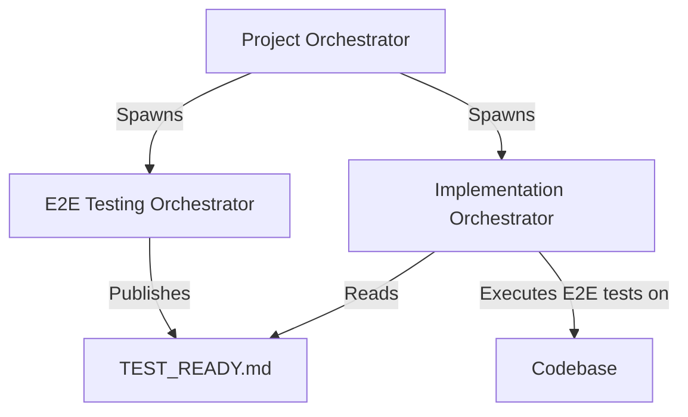

# CodeAvatar Project Implementation Plan

This plan details the dual-track execution of the CodeAvatar project, consisting of the Implementation Track and the E2E Testing Track.

## 1. Dual-Track Orchestration Topology
To maintain clean separation of concerns and ensure rigorous verification:
- **E2E Testing Track**: Autonomous track dedicated to designing, building, and publishing the opaque-box E2E test suite according to user requirements. It publishes `TEST_READY.md`.
- **Implementation Track**: Processes the codebase through Milestones 1 to 5, culminating in verification against the published E2E test suite.

## 2. Milestones & Issues

### Milestone 1: Core AI Pipeline (R1)
- **Scope**: Implement full pipeline logic through local Whisper (STT), Ollama (Translation + Glossary), Piper/XTTS-v2 (TTS), Wav2Lip + GFPGAN (Lip sync and face sharpening). Add VRAM unloading and isolated child multiprocessing. Pack script `pipeline_cli.py` and `Dockerfile.pipeline`.
- **Dependency**: None

### Milestone 2: Dynamic Time Alignment & FFMPEG Composition (R2 + R3)
- **Scope**: Implement DTA (speech speed auto-scaling 0.85x - 1.25x with pitch preservation), silence padding, video padding/freeze frames. Export transparent WebM VP9 (alpha channel), `.srt` with aligned timestamps, and `timeline_shifts.json`.
- **Dependency**: Milestone 1

### Milestone 3: FastAPI Backend & Database Queue (R4)
- **Scope**: FastAPI service coordinating tasks sequentially via FIFO Queue. SQLite database in WAL mode to persist jobs/segments data. Path traversal prevention for download paths.
- **Dependency**: Milestone 2

### Milestone 4: Aesthetic Web UI & SSE Logs (R5 part 1)
- **Scope**: React + Vite UI (glassmorphic dark mode). Script editor with Debounce. Real-time log tracking via Server-Sent Events (SSE).
- **Dependency**: Milestone 3

### Milestone 5: Google Drive Sync & OAuth (R5 part 2)
- **Scope**: OAuth 2.0 flow storing token in HttpOnly Cookie. Google Drive resumable upload for final assets. Complete 100% E2E test passes and adversarial hardening.
- **Dependency**: Milestone 4

## 3. Verification Protocol
- Standard unit tests under `/tests` targeting Whisper, Translator, DTA, and FastAPI.
- E2E testing track verification.
- Static security scans (Semgrep) on implementation.
- Forensic Auditor verification.
