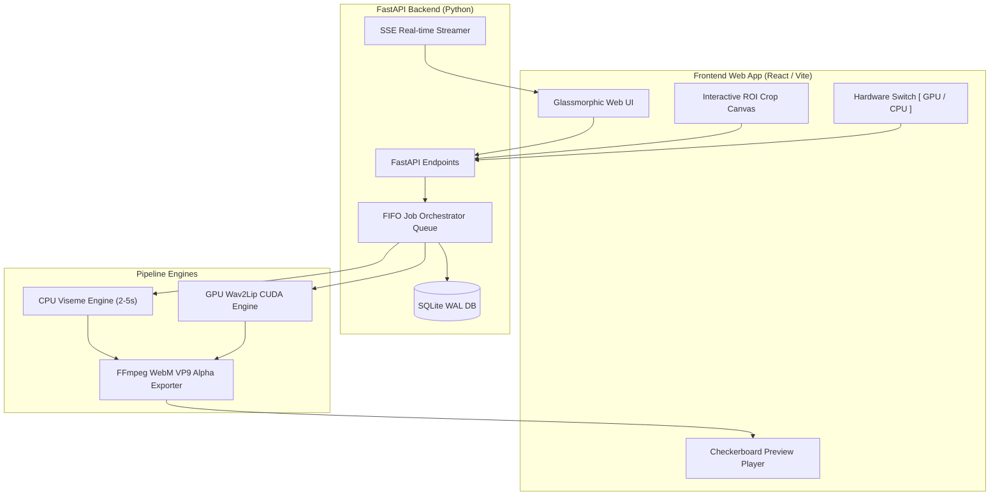

# CodeAvatar 🎭⚡

> **Dual-Engine AI Virtual Avatar & Lip-Sync Generator with Alpha Channel Transparency**

[](https://python.org)
[](https://fastapi.tiangolo.com)
[](https://reactjs.org)
[](https://ffmpeg.org)
[](LICENSE)

---

## 🌟 Overview

**CodeAvatar** is a high-performance, hybrid-compute AI avatar generation system designed to produce professional presenter (MC) videos with transparent backgrounds (Alpha Channel WebM VP9). It empowers creators, educators, and enterprise users to easily render realistic talking avatars for presentation videos, lectures, and digital broadcasts.

The system features a **Dual-Engine Render Architecture** featuring both an **Ultra-Fast CPU Viseme Engine** for instant rendering on lightweight laptops and a **High-Quality GPU Wav2Lip Engine** for realistic neural lip-syncing.

---

## ✨ Key Features

- ⚡ **Dual-Engine Rendering**:
  - **Ultra-Fast Mode (CPU - Viseme Engine)**: Renders 2–5 second videos instantly on standard office laptops without discrete GPU requirements.
  - **High-Quality Mode (GPU - Wav2Lip Engine)**: Harnesses NVIDIA CUDA GPUs for smooth, neural lip-syncing driven by deep learning models.
- 🎛️ **Hardware Toggle Switch**: Dynamic `[ GPU / CPU ]` hardware selection switch in the Web UI with graceful fallback to CPU mode if CUDA hardware is unavailable.
- 🖼️ **Transparent WebM VP9 Layer**: Outputs transparent video layers using `yuva420p` color space with `alpha_mode=1`, ready for seamless drag-and-drop into video editing tools (CapCut, Premiere Pro, DaVinci Resolve).
- 🎯 **Interactive Crop ROI Canvas**: Interactive region-of-interest (ROI) canvas selection for fine-tuning avatar face positioning.
- 🛰️ **Real-Time SSE Progress Stream**: Server-Sent Events (SSE) log streaming for real-time progress tracking.
- 🛡️ **Enterprise Security**: Built-in strict path traversal defenses using canonical path verification (`Path.is_relative_to()`) and zero-vulnerability static security scans (Semgrep).

---

## 🏗️ System Architecture



---

## 📁 Repository Structure

```text
CodeAvatar/
├── apps/
│   └── web/                   # Single-Page Web Application (React / Vite)
├── services/
│   ├── backend/               # FastAPI Backend Service (API Endpoints, Jobs, SSE)
│   │   └── main.py
│   └── pipeline/              # Core AI & Rendering Engines
│       ├── cpu_viseme.py      # Ultra-Fast CPU Viseme Engine
│       ├── gpu_lipsync.py     # High-Quality GPU Wav2Lip Engine
│       └── webm_exporter.py   # FFmpeg WebM VP9 Alpha Exporter
├── tests/                     # 4-Tier Automated Test Suite (Unit, Integration & E2E)
├── test/                      # Local Test Output Storage (Git-Ignored)
├── PROJECT.md                 # System Design & Vertical Slices Specification
├── ARCHITECTURE.md            # Technical Architecture & Interface Contracts
├── TEST_INFRA.md              # E2E & 4-Tier Test Suite Infrastructure Guide
├── HANDOFF.md                 # Session Status & Developer Handoff
└── README.md                  # Main Repository Documentation
```

---

## 📊 Render Engines Benchmark

| Criterion | Ultra-Fast Mode (CPU Viseme) | High-Quality Mode (GPU Wav2Lip) |
| :--- | :--- | :--- |
| **Hardware Required** | Any x86/ARM CPU (Intel i3/i5, Apple M1, AMD) | NVIDIA CUDA-enabled Discrete GPU |
| **Render Time** | **2 – 5 Seconds** (Fixed time frame) | ~0.1x Real-Time (~45-90s per 10min video) |
| **Resource Usage** | 0% GPU, < 10% CPU | Tensor Cores acceleration |
| **Output Format** | WebM VP9 (`yuva420p` + Alpha) | WebM VP9 (`yuva420p` + Alpha) |
| **Best Used For** | Fast previews, low-resource hardware | High-fidelity final production renders |

---

## 🛠️ Quick Start & Installation

### Prerequisites
- Python 3.10 or higher
- FFmpeg (compiled with `libvpx` for VP9 support)
- Node.js 18+ & npm (for Web UI)
- NVIDIA CUDA Toolkit (Optional, for GPU Wav2Lip engine)

### Setup Virtual Environment

```bash
# Clone repository
git clone https://github.com/user/CodeAvatar.git
cd CodeAvatar

# Create and activate Python virtual environment
python3 -m venv .venv
source .venv/bin/activate

# Install backend dependencies
pip install -r services/backend/requirements.txt
```

---

## 🚀 Running the Application

### 1. Launch FastAPI Backend

```bash
.venv/bin/uvicorn services.backend.main:app --reload --host 127.0.0.1 --port 8000
```
Backend API interactive docs will be available at `http://127.0.0.1:8000/docs`.

### 2. Launch Web Frontend

```bash
cd apps/web
npm install
npm run dev
```

---

## 🧪 Testing & Quality Assurance

The codebase maintains a **100% Pass Rate** across all unit, integration, and E2E test suites alongside static security scans.

### Run All Pytest Suites
```bash
.venv/bin/python -m pytest tests/ -v
```

### Run Static Security Scan (Semgrep)
```bash
semgrep scan --config=auto services/
```

---

## 📡 API Endpoints Summary

| Method | Endpoint | Description |
| :--- | :--- | :--- |
| `POST` | `/api/generate-avatar` | Submit audio + avatar template + crop ROI + hardware mode. Returns `job_id`. |
| `GET` | `/api/jobs/{job_id}/stream` | Real-time Server-Sent Events (SSE) progress log stream. |
| `GET` | `/api/jobs/{job_id}/download` | Download generated transparent WebM VP9 avatar video. |

---

## 📄 License

Distributed under the MIT License. See `LICENSE` for details.
