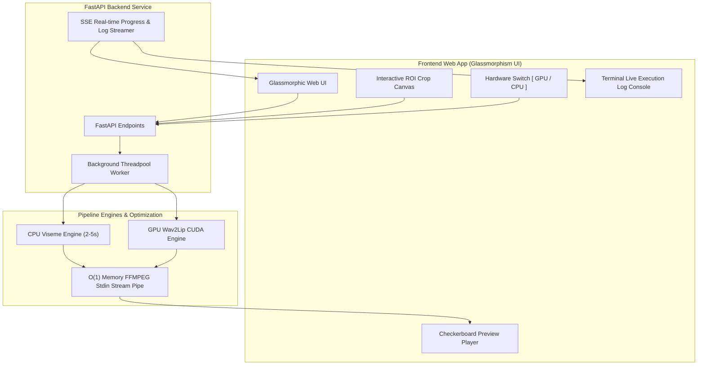

# CodeAvatar 🎭⚡

> **Dual-Engine AI Virtual Avatar & Lip-Sync Generator with Alpha Channel Transparency**

[](https://python.org)
[](https://fastapi.tiangolo.com)
[](https://www.docker.com)
[](https://ffmpeg.org)
[](LICENSE)

---

## 🌟 Overview

**CodeAvatar** là hệ thống tạo MC ảo AI hiệu năng cao, hỗ trợ xuất video nền trong suốt (Kênh Alpha WebM VP9). Hệ thống cho phép các nhà sáng tạo nội dung, giảng viên và doanh nghiệp dễ dàng tạo video phát thanh, bài giảng chuyên nghiệp với MC ảo nhép môi tự nhiên.

Hệ thống sở hữu **Kiến trúc Render Kép (Dual-Engine Architecture)** bao gồm **CPU Viseme Engine** siêu tốc (render 2-5s trên laptop văn phòng) và **GPU Wav2Lip Engine** chất lượng cao (tăng tốc bằng NVIDIA CUDA).

---

## ✨ Key Features

- ⚡ **Dual-Engine Rendering**:
  - **Chế độ CPU Viseme**: Siêu tốc 2–5 giây trên laptop văn phòng không có GPU rời.
  - **Chế độ GPU Wav2Lip**: Nhép môi AI mượt mà bằng mô hình deep learning tăng tốc CUDA.
- 🌊 **O(1) Memory Stream-Encoding Pipe**:
  - Nạp luồng byte khung hình RGBA trực tiếp vào FFMPEG qua pipe `stdin`, giữ bộ nhớ RAM **cố định ~150MB** bất kể video dài 30 phút hay 5 tiếng (triệt tiêu lỗi tràn RAM OOM).
- 💻 **Terminal Live Execution Console UI**:
  - Ô Console Terminal trực tiếp trên Web UI hiển thị chi tiết mốc thời gian, trạng thái từng bước và báo lỗi minh bạch (Full Exception Traceback).
- 🐳 **Docker Isolation with Resource Caps**:
  - Đóng gói ứng dụng cô lập trong Docker với giới hạn cứng **8 CPUs & 16GB RAM**, bảo vệ 100% hệ điều hành Host Linux không bao giờ bị đơ cứng.
- 🎛️ **Hardware Toggle Switch**:
  - Nút gạt phần cứng `[ 🚀 CPU / 🔥 GPU ]` linh hoạt kèm tính năng tự động lùi về CPU khi máy thiếu card CUDA.
- 🖼️ **Transparent WebM VP9 Layer**:
  - Xuất video WebM nền trong suốt mã màu `yuva420p` (`alpha_mode=1`), dễ dàng thả trực tiếp vào CapCut, Premiere Pro, DaVinci Resolve.
- 🎯 **Interactive Crop ROI Canvas**:
  - Khung chọn vùng mặt MC tương tác bằng chuột hoặc cảm ứng chạm.
- 🛡️ **Enterprise Security**:
  - Phòng chống triệt để lỗ hổng Path Traversal bằng kiểm tra canonical path (`Path.is_relative_to()`).

---

## 🏗️ System Architecture



---

## 📁 Repository Structure

```text
CodeAvatar/
├── Dockerfile                 # Container Debian cô lập tài nguyên cho CodeAvatar
├── docker-compose.yml         # Cấu hình Docker giới hạn 8.0 CPUs & 16GB RAM
├── run_docker.sh              # Script thực thi build & chạy container an toàn
├── requirements.txt           # Khai báo phụ thuộc Python
├── services/
│   ├── backend/               # FastAPI Backend (Endpoints, SSE Stream, Web UI)
│   │   └── main.py
│   └── pipeline/              # Core AI & Rendering Engines
│       ├── cpu_viseme.py      # Ultra-Fast CPU Viseme Engine
│       ├── gpu_lipsync.py     # High-Quality GPU Wav2Lip Engine
│       └── webm_exporter.py   # Stream Pipe FFmpeg WebM VP9 Alpha Exporter
├── tests/                     # Bộ kiểm thử tự động TDD (11/11 Passed)
├── HANDOFF.md                 # Tài liệu chuyển giao & Ngữ cảnh hệ thống
├── ARCHITECTURE.md            # Thiết kế kiến trúc kỹ thuật
└── README.md                  # Tài liệu hướng dẫn chính của dự án
```

---

## ⚡ Quick Start & Run Commands

### 1. Run via Docker Container (Recommended)
```bash
./run_docker.sh
```
Truy cập trình duyệt tại địa chỉ: `http://localhost:8005`

### 2. Run Local Python Virtual Environment
```bash
.venv/bin/uvicorn services.backend.main:app --reload --port 8000
```

### 3. Execute Automated Tests (TDD)
```bash
.venv/bin/python -m pytest tests/ -v
```

---

## 📄 License

Mã nguồn được phân phối theo giấy phép [MIT License](LICENSE).
